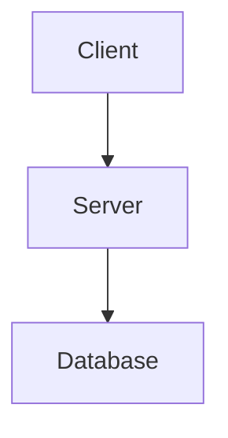
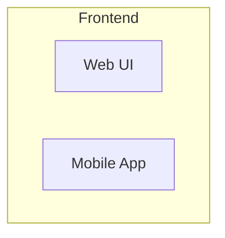

# Contributing to Plantalytix Documentation

Thank you for your interest in contributing to the Plantalytix to Home Assistant migration documentation! This guide will help you understand how to contribute effectively.

## 📋 Table of Contents

- [Code of Conduct](#code-of-conduct)
- [How Can I Contribute?](#how-can-i-contribute)
- [Documentation Standards](#documentation-standards)
- [Architecture Decision Records (ADRs)](#architecture-decision-records-adrs)
- [Mermaid Diagrams](#mermaid-diagrams)
- [Pull Request Process](#pull-request-process)
- [Style Guide](#style-guide)

## Code of Conduct

This project follows a professional and respectful code of conduct. We expect all contributors to:

- Be respectful and constructive in feedback
- Focus on technical merit and accuracy
- Help maintain documentation quality
- Collaborate openly and transparently

## How Can I Contribute?

### 🐛 Reporting Documentation Issues

If you find errors, unclear sections, or outdated information:

1. **Search existing issues** to avoid duplicates
2. **Create a new issue** with:
   - Clear title describing the problem
   - Location (file and section/line number)
   - What's incorrect or unclear
   - Suggested improvement (if applicable)

### 📝 Improving Documentation

You can contribute by:

- **Fixing typos and grammar errors**
- **Clarifying technical explanations**
- **Adding missing information**
- **Improving diagrams**
- **Creating new examples**
- **Updating outdated content**

### 🏗️ Creating New ADRs

For new architectural decisions:

1. Copy the MADR template (see [MADR repository](https://github.com/adr/madr))
2. Number sequentially (0011, 0012, etc.)
3. Follow the [ADR Guidelines](#architecture-decision-records-adrs)
4. Submit for review

## Documentation Standards

### File Organization

```
plantalytix/
├── README.md                        # Main entry point
├── CONTRIBUTING.md                  # This file
├── docs/
│   ├── *.md                         # Technical guides
│   ├── ARCHITECTURE-DIAGRAM.mmd     # Mermaid diagrams
│   └── decisions/
│       ├── README.md                # ADR index
│       └── *.md                     # Individual ADRs
```

### Naming Conventions

- **Files:** Use `kebab-case` for all markdown files
  - ✅ `home-assistant-setup.md`
  - ❌ `Home_Assistant_Setup.md`

- **ADRs:** Use format `NNNN-title-with-dashes.md`
  - ✅ `0011-implement-backup-strategy.md`
  - ❌ `ADR-11-backup.md`

- **Sections:** Use sentence case for headings
  - ✅ `## Getting started with Home Assistant`
  - ❌ `## Getting Started With Home Assistant`

### Markdown Best Practices

1. **Links:**
   ```markdown
   # Relative links for internal docs
   [ADR-0001](./docs/decisions/0001-migrate-to-home-assistant-platform.md)

   # Absolute links for external resources
   [Home Assistant Docs](https://www.home-assistant.io/docs/)
   ```

2. **Code Blocks:**
   ```markdown
   # Always specify language
   ```yaml
   homeassistant:
     name: Plantalytix
   ```

   # Not this
   ```
   code without language
   ```
   ```

3. **Line Length:**
   - Prefer line breaks at ~100-120 characters for readability
   - Exception: Long URLs can exceed this limit

4. **Images:**
   ```markdown
   # Use descriptive alt text
   
   ```

## Architecture Decision Records (ADRs)

We follow the [MADR](https://adr.github.io/madr/) (Markdown Architectural Decision Records) format.

### ADR Template Structure

Every ADR must include these sections:

```markdown
# [Number]. [Title]

**Status:** [Proposed | Accepted | Deprecated | Superseded]

**Date:** YYYY-MM-DD

## Context and Problem Statement

[Describe the context and problem in 2-3 paragraphs]

## Decision Drivers

* [Driver 1]
* [Driver 2]
* ...

## Considered Options

* [Option 1]
* [Option 2]
* ...

## Decision Outcome

Chosen option: "[option]", because [justification].

### Consequences

* **Good**, because [positive consequence]
* **Bad**, because [negative consequence]
* ...

## Pros and Cons of the Options

### [Option 1]

* **Good**, because [argument a]
* **Good**, because [argument b]
* **Bad**, because [argument c]

## More Information

[Links to additional resources, discussions, prototypes, etc.]
```

### ADR Lifecycle

```
Proposed → Under Review → Accepted → Implemented
                             ↓
                         Deprecated
                             ↓
                      Superseded by ADR-XXXX
```

### Updating ADRs

- **Never delete** or significantly modify accepted ADRs
- To change an accepted decision:
  1. Create a new ADR superseding the old one
  2. Update the old ADR status to "Superseded by ADR-XXXX"
  3. Link between the two ADRs

## Mermaid Diagrams

### GitHub Rendering

Mermaid diagrams are rendered natively on GitHub. Follow these guidelines:

#### 1. **Inline Diagrams** (Preferred for GitHub)

```markdown
## System Architecture


```

#### 2. **Separate .mmd Files** (For Complex Diagrams)

For large diagrams, use separate `.mmd` files:

```markdown
# In docs/ARCHITECTURE-DIAGRAM.mmd



# Reference in other docs:
See [Architecture Diagram](./docs/ARCHITECTURE-DIAGRAM.mmd)
```

### Diagram Best Practices

1. **Keep it simple:** One diagram = one concept
2. **Use subgraphs** for grouping related components
3. **Consistent styling:**
   ```mermaid
   graph TB
       classDef frontend fill:#E3F2FD,stroke:#1976D2
       classDef backend fill:#C8E6C9,stroke:#388E3C

       A[Web UI]:::frontend
       B[API Server]:::backend
   ```

4. **Add comments:**
   ```mermaid
   graph TB
       %% User-facing components
       A[Web UI]

       %% Backend services
       B[API]
   ```

5. **Test rendering** on GitHub before committing

### Supported Diagram Types

- **Flowcharts:** `graph TB`, `graph LR`
- **Sequence diagrams:** `sequenceDiagram`
- **Class diagrams:** `classDiagram`
- **State diagrams:** `stateDiagram-v2`
- **Entity relationships:** `erDiagram`
- **User journeys:** `journey`

## Pull Request Process

### Before Submitting

1. **Read related documentation** to understand context
2. **Check for existing PRs** addressing the same issue
3. **Test Mermaid diagrams** render correctly on GitHub
4. **Spell check** your changes
5. **Validate markdown** syntax

### PR Template

```markdown
## Description

[Brief description of changes]

## Type of Change

- [ ] Documentation fix (typo, grammar, clarity)
- [ ] New content (guides, examples, diagrams)
- [ ] New ADR
- [ ] Update existing ADR
- [ ] Diagram improvements

## Checklist

- [ ] Followed markdown style guide
- [ ] Links work correctly
- [ ] Mermaid diagrams render on GitHub
- [ ] ADR follows MADR format (if applicable)
- [ ] Updated table of contents (if needed)
- [ ] Spell-checked content

## Related Issues

Closes #[issue number]
```

### Review Process

1. **Automated checks** will validate:
   - Markdown syntax
   - Link integrity
   - File naming conventions

2. **Reviewer will check:**
   - Technical accuracy
   - Clarity and readability
   - Adherence to style guide
   - Mermaid diagram quality

3. **Approval requirements:**
   - At least 1 approval for documentation fixes
   - At least 2 approvals for new ADRs

## Style Guide

### Terminology

**Consistent terms:**
- ✅ "Home Assistant" (not "HomeAssistant" or "HA Core")
- ✅ "MQTT Discovery" (capitalized)
- ✅ "ESPHome" (not "ESP Home")
- ✅ "Lovelace" for HA dashboards
- ✅ "ADR" for Architecture Decision Record

**Abbreviations:**
- Define on first use: "Architecture Decision Record (ADR)"
- Use abbreviation consistently after first definition

### Voice and Tone

- **Active voice:** "The system processes requests" (not "Requests are processed")
- **Present tense:** "Home Assistant provides..." (not "will provide")
- **Direct and concise:** Remove unnecessary words
- **Technical but accessible:** Explain jargon when first used

### Formatting

#### Headers

```markdown
# Top-level (H1) - Document title only
## Main sections (H2)
### Subsections (H3)
#### Details (H4)
```

#### Lists

```markdown
# Ordered lists for steps
1. First step
2. Second step
3. Third step

# Unordered lists for items
- Item one
- Item two
- Item three

# Use consistent markers (- or *)
```

#### Emphasis

```markdown
**Bold** for important terms and UI elements
*Italic* for subtle emphasis
`code` for inline code, commands, filenames
```

#### Tables

```markdown
| Column 1 | Column 2 | Column 3 |
|----------|----------|----------|
| Data 1   | Data 2   | Data 3   |
| Data 4   | Data 5   | Data 6   |
```

#### Code Examples

```markdown
# Include descriptive comments
```yaml
# Configuration for Home Assistant MQTT integration
mqtt:
  broker: localhost
  port: 1883
  discovery: true  # Enable MQTT Discovery protocol
```
```

## Questions?

- **General questions:** Create a GitHub discussion
- **Documentation issues:** Open an issue
- **Urgent matters:** Contact the architecture team

## License

By contributing, you agree that your contributions will be licensed under the same license as the project.

---

**Thank you for contributing to Plantalytix documentation!** 🎉
