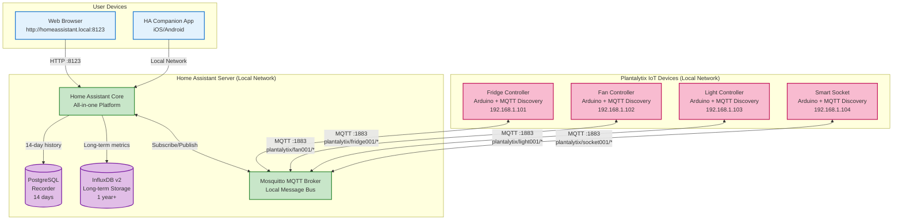
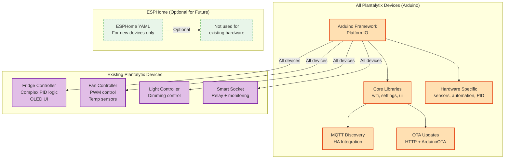
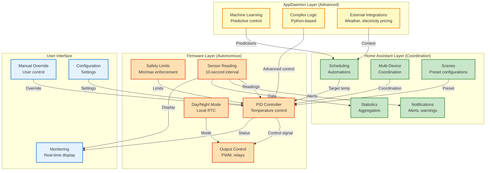
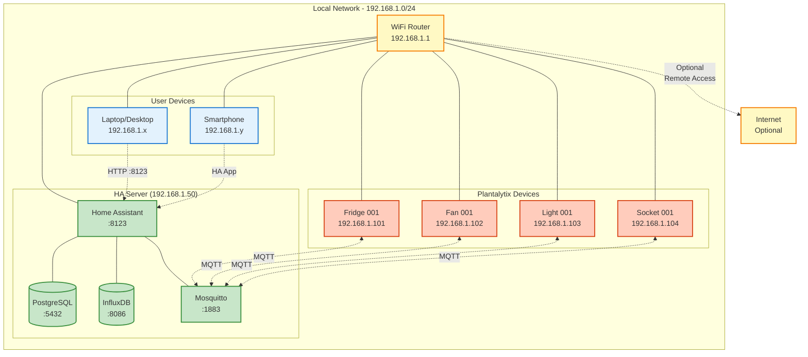
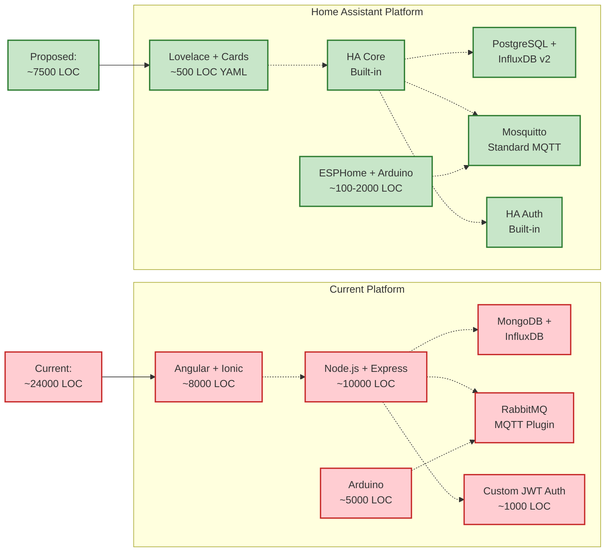
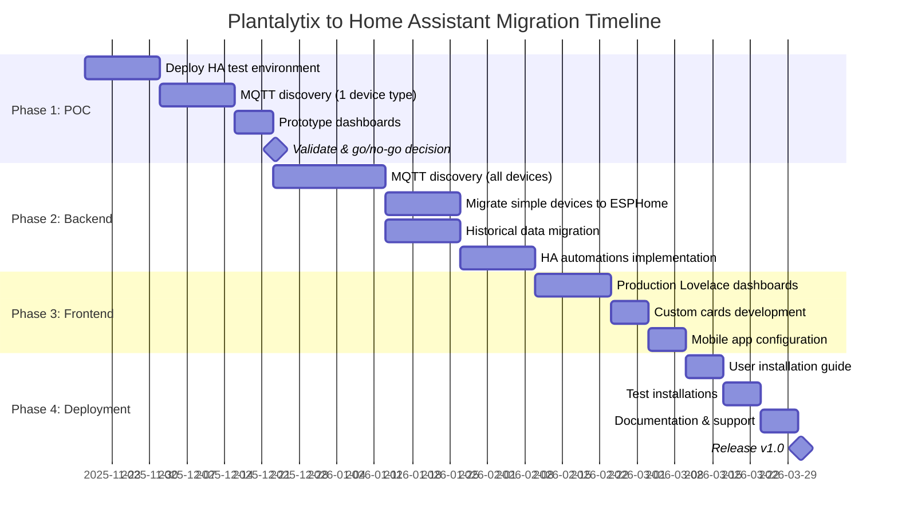
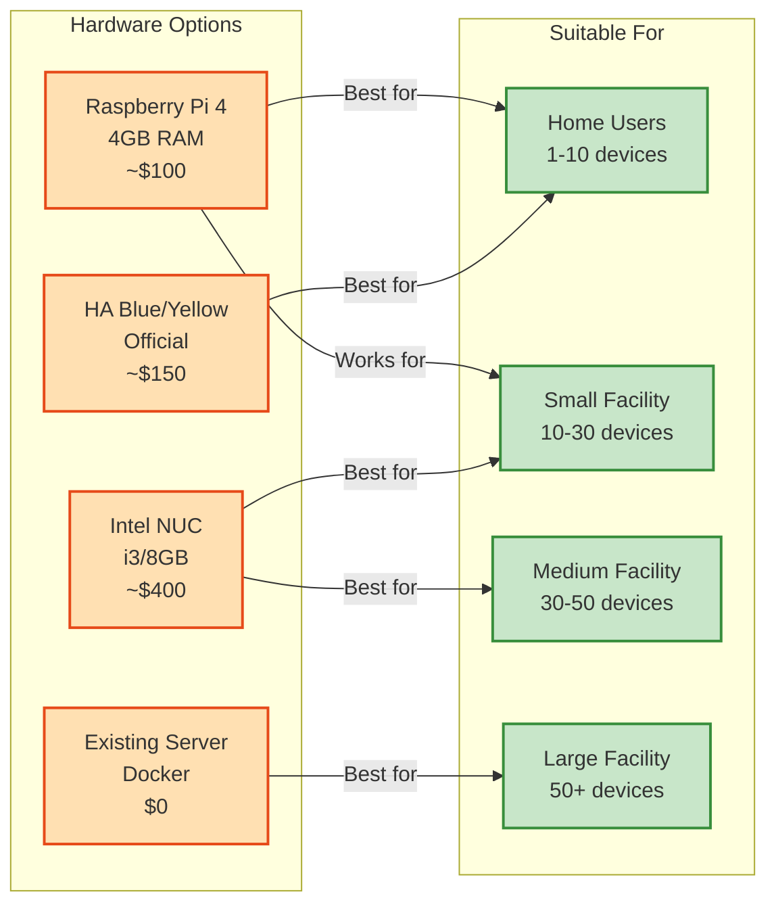

# Plantalytix Home Assistant Architecture
## Single-User Local Network Deployment

## System Overview Diagram

## MQTT Discovery Flow

```mermaid
sequenceDiagram
    participant Device as ESP32 Device<br/>(Fridge Controller)
    participant MQTT as MQTT Broker<br/>(Mosquitto)
    participant HA as Home Assistant
    participant UI as User Interface<br/>(Lovelace)

    Note over Device: Device boots up
    Device->>MQTT: Connect to broker
    MQTT-->>Device: Connected

    Note over Device: Publish discovery config
    Device->>MQTT: homeassistant/climate/fridge001/config<br/>{name, unique_id, device, topics...}
    Device->>MQTT: homeassistant/sensor/fridge001_temp/config<br/>{name, device_class, state_topic...}
    Device->>MQTT: homeassistant/sensor/fridge001_humidity/config
    Device->>MQTT: homeassistant/sensor/fridge001_co2/config

    MQTT->>HA: Forward discovery messages

    Note over HA: Auto-create entities
    HA->>HA: Create climate.fridge001
    HA->>HA: Create sensor.fridge001_temp
    HA->>HA: Create sensor.fridge001_humidity
    HA->>HA: Create sensor.fridge001_co2

    Note over Device: Mark as available
    Device->>MQTT: plantalytix/fridge001/status = "online"
    MQTT->>HA: Forward status
    HA->>HA: Mark entities available

    Note over Device: Publish sensor data
    Device->>MQTT: plantalytix/fridge001/sensor/temperature = 22.5
    MQTT->>HA: Forward data
    HA->>HA: Update sensor.fridge001_temp
    HA->>UI: Display in dashboard

    Note over UI: User sets temperature
    UI->>HA: Set climate.fridge001 to 20°C
    HA->>MQTT: plantalytix/fridge001/set/temperature = 20.0
    MQTT->>Device: Forward command
    Device->>Device: Update target temperature

    Note over Device: Publish state update
    Device->>MQTT: plantalytix/fridge001/state<br/>{mode: "auto", target_temp: 20.0}
    MQTT->>HA: Forward state
    HA->>UI: Update UI
```

## Data Flow Architecture

```mermaid
graph LR
    subgraph "Device Firmware"
        Sensors[Sensors<br/>SHT31, SCD30, etc.]
        PID[PID Controller<br/>Autonomous]
        Outputs[Outputs<br/>Heater, Fan, etc.]
        MQTT_Client[MQTT Client<br/>PubSubClient]
    end

    subgraph "Home Assistant"
        MQTT_Int[MQTT Integration<br/>Discovery]
        Climate[Climate Entity<br/>Thermostat]
        SensorEnts[Sensor Entities<br/>Temp, Humidity, CO2]
        Recorder[Recorder<br/>PostgreSQL]
        InfluxInt[InfluxDB Integration]
        Automations[Automations<br/>YAML/UI]
        AppDaemon[AppDaemon<br/>Python Logic]
    end

    subgraph "Storage"
        PG[(PostgreSQL<br/>14 days)]
        Influx[(InfluxDB v2<br/>1 year+)]
    end

    subgraph "User Interface"
        Lovelace[Lovelace Dashboard<br/>ApexCharts]
        Mobile[Mobile App<br/>Notifications]
    end

    %% Sensor flow
    Sensors -->|Read every 10s| PID
    PID -->|Control signal| Outputs
    Sensors -->|Temperature| MQTT_Client
    Outputs -->|State| MQTT_Client

    %% MQTT to HA
    MQTT_Client -->|Publish state| MQTT_Int
    MQTT_Int -->|Update| Climate
    MQTT_Int -->|Update| SensorEnts

    %% Storage
    Climate -->|State changes| Recorder
    SensorEnts -->|Measurements| Recorder
    Recorder -->|Write| PG
    Climate -->|Time-series| InfluxInt
    SensorEnts -->|Time-series| InfluxInt
    InfluxInt -->|Write| Influx

    %% Automations
    Climate -->|Trigger| Automations
    SensorEnts -->|Trigger| Automations
    Automations -->|Control| Climate
    SensorEnts -->|Trigger| AppDaemon
    AppDaemon -->|Advanced logic| Climate

    %% UI
    Climate -->|Display| Lovelace
    SensorEnts -->|Charts| Lovelace
    Influx -->|Historical data| Lovelace
    Climate -->|Alerts| Mobile
    Automations -->|Notifications| Mobile

    %% Styling
    classDef firmware fill:#FFE0B2,stroke:#E64A19
    classDef ha fill:#C8E6C9,stroke:#388E3C
    classDef storage fill:#E1BEE7,stroke:#7B1FA2
    classDef ui fill:#E3F2FD,stroke:#1976D2

    class Sensors,PID,Outputs,MQTT_Client firmware
    class MQTT_Int,Climate,SensorEnts,Recorder,InfluxInt,Automations,AppDaemon ha
    class PG,Influx storage
    class Lovelace,Mobile ui
```

## Firmware Architecture

## Automation & Control Logic Distribution

## Local Network Deployment

## Firmware Update Management

```mermaid
graph TB
    subgraph "Firmware Sources"
        GitHub[GitHub Releases<br/>Official stable]
        GitLab[GitLab Releases<br/>Community beta]
        Custom[Custom HTTP<br/>Experimental]
    end

    subgraph "Home Assistant Integration"
        SourceMgr[Source Manager<br/>Poll every 1h]
        UpdateCoord[Update Coordinator<br/>Version tracking]
        UpdateEntity[Update Entities<br/>Per device]
    end

    subgraph "Update UI"
        Settings[Settings → Updates]
        Changelog[Changelog Display]
        Controls[Install/Skip/Rollback]
    end

    subgraph "Device Update"
        MQTT_Notify[MQTT Notification<br/>firmware/update topic]
        Download[HTTP Download<br/>Firmware binary]
        Flash[Flash & Reboot<br/>OTA process]
        Verify[Version Verification<br/>Post-update]
    end

    %% Source to HA
    GitHub -->|API poll| SourceMgr
    GitLab -->|API poll| SourceMgr
    Custom -->|HTTP poll| SourceMgr
    SourceMgr -->|New version| UpdateCoord
    UpdateCoord -->|Create/Update| UpdateEntity

    %% UI flow
    UpdateEntity -->|Display| Settings
    UpdateEntity -->|Show| Changelog
    Settings -->|User action| Controls

    %% Update delivery
    Controls -->|Trigger| MQTT_Notify
    MQTT_Notify -->|URL + checksum| Download
    Download -->|Binary| Flash
    Flash -->|Success| Verify
    Verify -->|Report version| UpdateCoord

    classDef sourceStyle fill:#E1F5FE,stroke:#0277BD,stroke-width:2px
    classDef haStyle fill:#C8E6C9,stroke:#388E3C,stroke-width:2px
    classDef uiStyle fill:#F3E5F5,stroke:#6A1B9A,stroke-width:2px
    classDef deviceStyle fill:#FFCCBC,stroke:#D84315,stroke-width:2px

    class GitHub,GitLab,Custom sourceStyle
    class SourceMgr,UpdateCoord,UpdateEntity haStyle
    class Settings,Changelog,Controls uiStyle
    class MQTT_Notify,Download,Flash,Verify deviceStyle
```

## Technology Stack Comparison

## Migration Phases Timeline

## Deployment Hardware Options

---

## Legend

### Color Coding
- 🔵 **Blue** - User interfaces and clients
- 🟢 **Green** - Home Assistant components and services
- 🟡 **Yellow** - Network infrastructure
- 🔴 **Red/Orange** - IoT devices and firmware
- 🟣 **Purple** - Databases and storage

### Component Types
- **Rectangle** - Service/Application
- **Cylinder** - Database
- **Parallelogram** - User interface
- **Diamond** - Decision point

### Connection Types
- **Solid line** - Data flow
- **Dashed line** - Optional/configuration
- **Dotted line** - Management

---

## Key Differences from Multi-Tenant Architecture

### Removed Components
- ❌ Tenant orchestration
- ❌ Multi-tenant MQTT ACLs
- ❌ Per-tenant InfluxDB buckets
- ❌ Nginx reverse proxy (multiple domains)
- ❌ Custom user management
- ❌ JWT authentication system
- ❌ Device claim code system
- ❌ Tenant provisioning API

### Simplified Components
- ✅ Single HA instance (not per-tenant)
- ✅ Single PostgreSQL database
- ✅ Single InfluxDB bucket
- ✅ Simple MQTT broker (no ACLs needed)
- ✅ Direct device access (no ownership model)
- ✅ HA built-in auth (no custom auth)

---

## Related Documentation

- [Architecture Analysis](../ARCHITECTURE-ANALYSIS.md) - Current system deep-dive
- [Migration Summary](../MIGRATION-SUMMARY.md) - Executive summary
- [ADR Index](./decisions/README.md) - All architecture decisions
- [Getting Started Guide](./GETTING-STARTED-HA.md) - Hands-on setup
- [ADR-0006: Single-User Deployment](./decisions/0006-home-assistant-single-user-deployment.md) - Deployment strategy

---

**Generated**: 2025-11-15
**Version**: 2.0 (Updated for single-user deployment)
**Format**: Mermaid.js
**View online**: Use [Mermaid Live Editor](https://mermaid.live/) or GitHub/GitLab rendering
